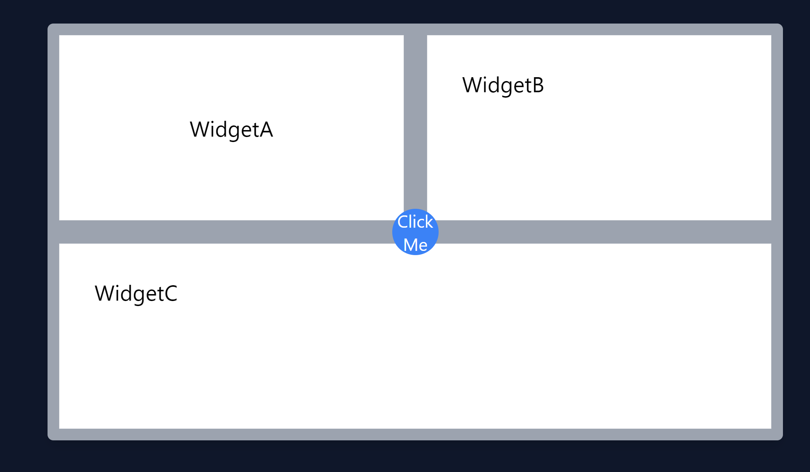
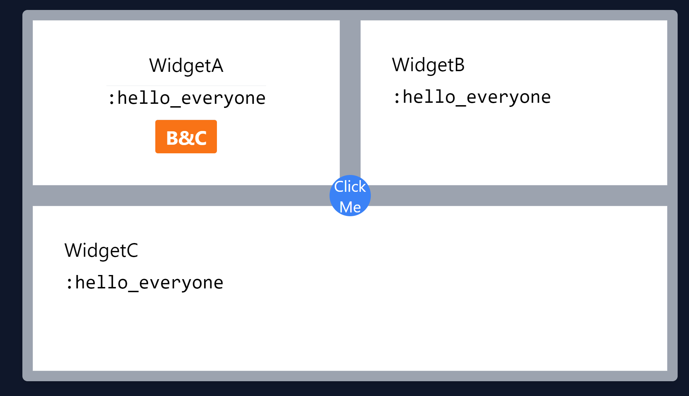
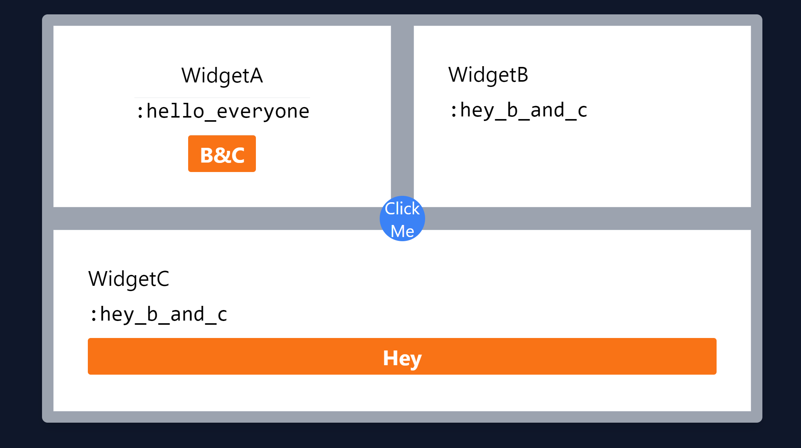
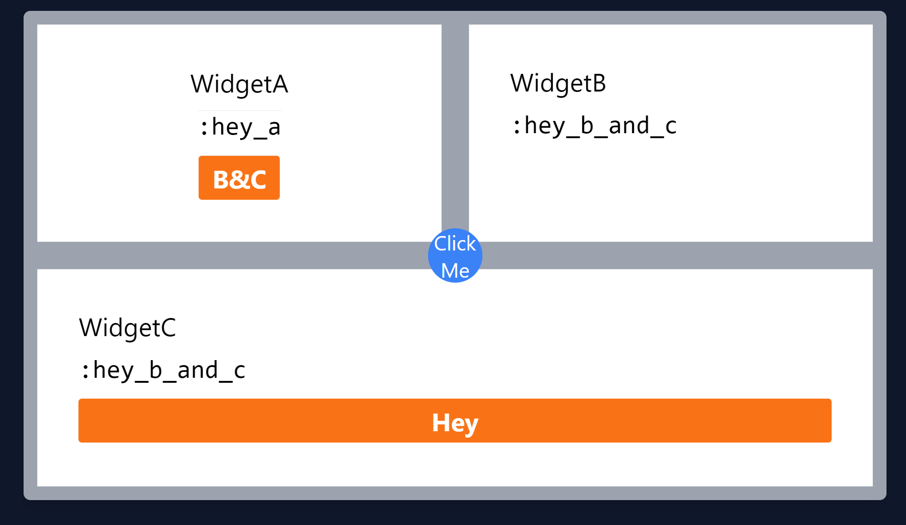

# LiveViewEventPassingDemo

This project demonstrates how to use the `:syn` library to publish messages between LiveView subscribers in a Phoenix application.

## Overview

In this application, we have several LiveView components (WidgetA, WidgetB, WidgetC, and WidgetCircle) that need to communicate with each other. To facilitate this communication, we use the `:syn` library, which provides a mechanism for process grouping and process registry in Elixir.

Each LiveView component subscribes to a group in the `:syn` registry when it is mounted. The group is identified by a session ID, which is stored in the session cookie. This allows us to send messages to all LiveView components that belong to the same session.

## LiveViewDispatcher

The `LiveViewEventPassingDemo.OTP.LiveViewDispatcher` module is a GenServer that acts as an interface to the `:syn` library. It provides the following functions:

- `start_link/0`: Starts the GenServer with a global name, allowing it to be accessed from any node in the cluster.
- `init/1`: Adds the current node to the `:live_view_dispatch` global scope.
- `subscribe/1`: Subscribes a process to a group in the `:syn` registry.
- `publish/2`: Publishes a message to a group in the `:syn` registry.

## LiveView Components

Each LiveView component (WidgetA, WidgetB, WidgetC, and WidgetCircle) subscribes to a group in the `:syn` registry when it is mounted. The group is identified by the session ID, which is retrieved from the session cookie.

When a LiveView component receives an event (for example, when a button is clicked), it publishes a message to its group or {group, member} in the `:syn` registry. This message is then received by all other LiveView components that are subscribed to the same group.

This allows for targeting chains / sections of components assuming each nesting layer takes it's parent group 
and subscribes to it (and it's descendents by unrolling the tuple) and then publishes to it's own group.

Using syn in this manner allows backend processes, other components, etc. to push interested parties. 
The unique per session id can be omitted to register for messages globally.

LiveViewEventPassingDemo.OTP.LiveViewDispatcher.subscribe(:system_notifications)
Further using Record defrecord tuples, and function guards can be used to further refine the messages
a component responds to.

See the unused but included LiveViewEvent.ex file. 


## Session Management

The `LiveViewEventPassingDemo.OTP.LiveViewDispatcher.Plug` module is a Plug that manages the session cookie. When a request is received, it retrieves the current session ID from the session cookie. If the session ID doesn't exist, it generates a new one and stores it in the session cookie.

## Example Screens










## Conclusion

This project demonstrates how to use the `:syn` library to facilitate communication between LiveView components in a Phoenix application. By using `:syn`, we can send messages to all LiveView components that belong to the same session, allowing them to react to events in real time.


# Alternative Implementation
The same effect can be achieved while avoiding the use of the OTP library `:syn` by using the `Phoenix.PubSub` library instead. This library is already included in Phoenix applications, so it doesn't require any additional dependencies.
However using syn (and syn groups listing members to forward onwards to with an adjusted publish message) 
will often be more efficient than pubsub string matching. 

```elixir

# -------------------------------------------------------------------------------
# Author: Keith Brings
# Copyright (C) 2023 Noizu Labs, Inc. All rights reserved.
# -------------------------------------------------------------------------------

defmodule NoizuIntellect.LiveEventModule do
  @moduledoc """
  The LiveEventModule is used for subscribing to and receiving events between LiveView Components
  for universal state updates such as login/logout events where standard methods fall apart.
  """

  require Record
  require Logger
  alias Phoenix.PubSub

  Record.defrecord(:event, subject: nil, instance: nil, event: nil, payload: nil, options: nil)

  def unsubscribe(
        event(
          subject: s_subject,
          instance: s_instance,
          event: s_event
        )
      ) do
    key =
      [s_subject, s_instance, s_event]
      |> Enum.map(&"#{&1 || "*"}")
      |> Enum.join(":")

    # Logger.warn("PUBSUB Unsubscribe: #{key}")
    PubSub.unsubscribe(NoizuIntellect.LiveViewEvent, key)
  end

  def subscribe(
        msg =
          event(
            subject: s_subject,
            instance: s_instance,
            event: s_event
          )
      ) do
    IO.inspect(msg, label: :subscribe)

    key =
      [s_subject, s_instance, s_event]
      |> Enum.map(&"#{&1 || "*"}")
      |> Enum.join(":")

    # Logger.warn("PUBSUB Subscribe: #{key}")
    PubSub.subscribe(NoizuIntellect.LiveViewEvent, key)
  end

  def publish(
        event(
          subject: s_subject,
          instance: s_instance,
          event: s_event,
          payload: _payload
        ) = msg
      ) do
    IO.inspect(msg, label: :publish)
    # This is super inefficient, better routing will be needed in the future.
    # - Consider just switching to Syn and dedicating a message coordinater per User or User Session, although there are some upsides to pushing updates
    # - via pub sub for keeping pages synched across users/devices/sessions with out needing to add a bunch of addtiional logic.
    keys = [
      "#{s_subject}:*:*",
      "#{s_subject}:#{s_instance}:*",
      "#{s_subject}:#{s_instance}:#{s_event}",
      "#{s_subject}:*:#{s_event}"
    ]

    # Logger.info("PUB-SUB-EMIT: #{inspect keys} -> #{inspect msg}")
    Enum.map(keys, fn key ->
      PubSub.broadcast(
        NoizuIntellect.LiveViewEvent,
        key,
        msg
      )
    end)
    :ok
  end
end


```
